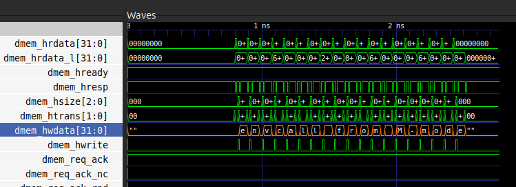

## Постановка задачи 
Обработать исключение вида Environment call from M-mode выводом строки «envcall from M-
mode». Выполнить настройку ресет вектора и вектора обработки прерываний на 0xB000 и 0x800
соответственно. Проверить работу программы на примере isa/rv32mi/
scall.S

## Ход работы
Добавим копию репозитория SCR1 на личный аккаунт GitHub. В полученной копии репозитории создадим ветку под названием "lab_scr1_sim", которая в результате будет содержать все произведённые в исходном проекте изменения.
Осуществим предустановку требуемого инструментария, включая GNU toolchain для RISC-V и симулятор Verilator. Алгоритм работы с репозиторием в общих чертах представлен на листинге ниже.
~~~bash
cd <WORK_LIB>
git clone https://github.com/<Ваш github ник>/scr1 # клонирование 
cd ./scr1 # переходим в папку с проектом
git submodule update --init --recursive # обновляем сабрепо с тестами
git checkout -b lab_scr1_sim # создаем ветку для выполнения лабораторной и переходим в нее

code . # Выполняем лабораторную работу в visual studio code

git add . # индексируем все измения
git commit -am "add lab" # создаем коммит
git push origin lab_scr1_sim # пушим коммит на сервер
~~~
В среде VS Code выполним следующий порядок действий, согласно методическим указаниям:
* Добавим директорию "lab_scr1_sim", в ней создадим файл README.md, содержащий постановку задачи и описание выполненной работы.
* Изменим список тестов в файле .../scr1/sim/tests/riscv_isa/rv32_tests.inc. Оставим только строчку с названием целевого теста.
* Укажем путь до тулчейна.
* Осуществим пробный запуск симуляции командой "make TARGETS="riscv_isa"". По результатам выполнения убедимся в корректности исполнения с внесёнными изменениями.
* Модифицируем вектора прирываний и ресетов в процессоре. В файле"scr1/src/includes/scr1_arch_description.svh" меняем значения для параметров "SCR1_ARCH_RST_VECTOR" и "SCR1_ARCH_MTVEC_BASE"
* Внесём изменения в конфигурацию линковщика для правильной сборки проекта.
    * В файле "sim/tests/common/link.ld" скорректируем смещение кода. Ввиду указанного смещения для начала программы внесём коррективы в размер выделяемой области памяти.
    * Дополнительно скорректируем смещение в файле "sim/tests/common/riscv_macros.h"
    * в случае неправильной настройки тест перестанет проходить. В файле дампа, находящемся по пути "scr1/build/verilator_AHB_MAX_imc_IPIC_1_TCM_1_VIRQ_1_TRACE_0/scall.dump" сверимся с адресами начала программы и trap-вектора. При перезапуске очистим предыдущий результат сборки с помощью "make clean"
* По завершении настройки векторов модифицируем обработчик прерывания для вывода сообщения согласно варианту.

Для просмотра wave формы установим утилиту gtkwave командой "udo apt install gtkwave". Осуществим сборку теста, включающую wave-файл командой "make run_verilator_wf TARGETS="riscv_isa"". В директории "scr1/build/verilator_wf_AHB_MAX_imc_IPIC_1_TCM_1_VIRQ_1_TRACE_0" запустим полученную форму с помощью установленной утилиты.
В окне просмотра добавим перечень сигналов, на полученном временном представлении убедимся в осуществлении вывода сообщения. Результат представлен на рисунке ниже.

